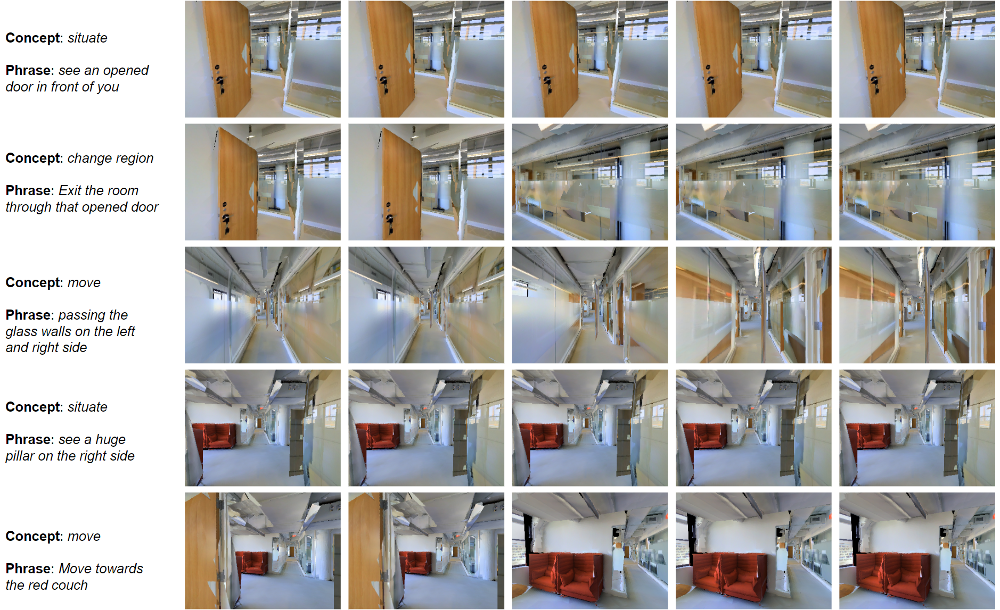
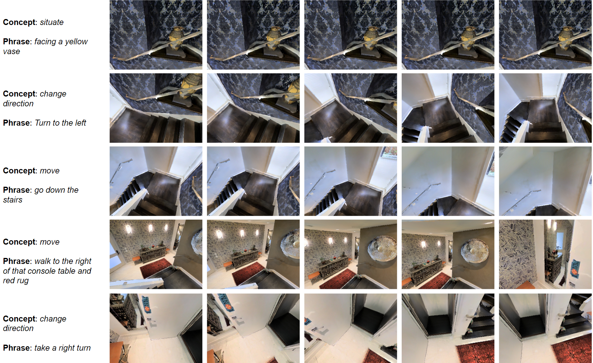

# Introducing NAVCON: A Large Scale Cognitively Inspired and Linguistically Grounded Corpus for Vision-Language Navigation

## NAVCON concept annotations 
- NAVCON contains annotations of instructions taken from the following two [VLN datasets](https://github.com/jacobkrantz/VLN-CE): a) [R2R VLNCE](https://bringmeaspoon.org/): Room-to-Room Vision and Language Navigation in Continuous Environments and b) [RxR VLNCE](https://ai.google.com/research/rxr/): Room-Across-Room Vision and Language Navigation in Continuous Environments.
- We leverage the Train data splits from these two publicly available VLN datasets to extract 30,815 (19,996 from RxR and 10,819 from R2R) English language instructions to release 236,316 concept instantiations.
- By typing the following command in your terminal you can download three files: ```root_verbs_final.csv```,```RXR_R2R_meta_data.txt```, ```RxR_meta_data.txt```, and ```rxr_mapping.txt``` together as a compressed archive file.
  
  **Command:** ```Hidden during review phase.```

  Details on the three files are as follows:

  
1. ```root_verbs_final.csv``` is the dataset containing all 80 Root Verbs that were manually annotated by the authors to assign unambiguous concepts. 


2. The ```RxR_R2R_meta_data.txt``` dataset is a json of the following structure:
    - It has four main elements: ```"sentence"```, ```"final_phrase"```, ```"final_concept"```, ```"meta_dict"```. All of these are list of 30,815 items.
    - ```"sentence"```: List of 30,815 RxR and R2R instructions
    - ```"final_phrase"```: List of 30,815 lists. Each list contains concept phrases from the respective instruction.
    - ```"final_concept"```: List of 30,815 lists. Each list contains concepts for the respective phrases.
    - ```"meta_dict"```: List of 30,815 dictionaries. There could be cases where no concepts were identified in an instruction by [Stanza Constituency Parser](https://stanfordnlp.github.io/stanza/constituency.html) and in those cases ```"meta_dict"``` would be blank ```{}```. Each dictionary contains following meta data for the respective phrases:
      - ```"phrase"```: List of concept phrases
      - ```"start_idx"```: Character starting indices of the respective concept phrases
      - ```"stop_idx"```: Character stopping indices of the respective concept phrases
      - ```"concept"```: List of concepts
      - ```"rem_start_idx"```: Character starting indices of the remaining text excluding concept phrases
      - ```"rem_stop_idx"```: Character stopping indices of the remaining text excluding concept phrases
      - ```"concept_words"```: List of concept phrases as words split at white-space
      - ```"concept_idx"```: List of indices of concept words split at white-space
      - ```"remaining_words"```: List of remaining words split at white-space
      - ```"remaining_idx"```: List of pairs of (start and stop) word indices of the remaining words
     
        
3. The ```RxR_meta_data.txt``` dataset is a json with same elements as above with 2 more keys in the ```"meta_dict"``` dictionary since these timestamps were not available for R2R dataset:
      - ```"timestamp"```: List of (Token/Phrase - Timestamp) mapping taken directly from RxR Training data split
      - ```"concept_timestamp"```: List of dictionary of concept-timestamp mapping
        - ```concept```: List of concepts
        - ```start```:List of starting timestamps for the respective concepts
        - ```end```:List of ending timestamps for the respective concepts

        
4. The ```rxr_mapping.txt``` dataset is a json with the following keys:
      - ```"general_idx"```: List of 19996 indices representing the items highlighted in ```RxR_meta_data.txt``` above.
      - ```"instruction_id"```: List of corresponding **Instruction ID** from RxR video dataset. This mapping was used to tie the ```RXR_meta_data.txt``` dataset with **NAVCON concept-video clips dataset** described in the end of this document.


Following is the structure of the JSON:

        
```JSON
{
  "sentence": [
    "You will start by standing in front of a glass door and on your right is a doorway. Turn around and you will see a doorway to the washroom. Walk towards the doorway and inside the washroom. Once you're there, stand in between the sink and the bathtub and once you're there, you're done."
  ],
  "final_phrase": [
    [
      "standing in front of a glass door",
      "Turn around",
      "see a doorway to the washroom",
      "Walk towards the doorway and inside the washroom",
      "stand in between the sink and the bathtub"
    ]
  ],
  "final_concept": [
    [
      "situate",
      "change direction",
      "situate",
      "move",
      "situate"
    ]
  ],
  "meta_dict": [
    [
      {
        "phrase": [
          "standing in front of a glass door",
          "Turn around",
          "see a doorway to the washroom",
          "Walk towards the doorway and inside the washroom",
          "stand in between the sink and the bathtub"
        ],
        "start_idx": [
          18,
          84,
          109,
          140,
          209
        ],
        "stop_idx": [
          52,
          96,
          139,
          189,
          251
        ],
        "concept": [
          "situate",
          "change direction",
          "situate",
          "move",
          "situate"
        ],
        "rem_start_idx": [
          0,
          52,
          96,
          139,
          189,
          251
        ],
        "rem_stop_idx": [
          18,
          84,
          109,
          140,
          209,
          286
        ],
        "concept_words": [
          [
            "standing",
            "in",
            "front",
            "of",
            "a",
            "glass",
            "door"
          ],
          [
            "Turn",
            "around"
          ],
          [
            "see",
            "a",
            "doorway",
            "to",
            "the",
            "washroom."
          ],
          [
            "Walk",
            "towards",
            "the",
            "doorway",
            "and",
            "inside",
            "the",
            "washroom."
          ],
          [
            "stand",
            "in",
            "between",
            "the",
            "sink",
            "and",
            "the",
            "bathtub"
          ]
        ],
        "concept_idx": [
          [
            4,
            11
          ],
          [
            18,
            20
          ],
          [
            23,
            29
          ],
          [
            29,
            37
          ],
          [
            40,
            48
          ]
        ],
        "remaining_words": [
          [
            "You",
            "will",
            "start",
            "by"
          ],
          [
            "and",
            "on",
            "your",
            "right",
            "is",
            "a",
            "doorway."
          ],
          [
            "and",
            "you",
            "will"
          ],
          [
            "Once",
            "you're",
            "there,"
          ],
          [
            "and",
            "once",
            "you're",
            "there,",
            "you're",
            "done."
          ]
        ],
        "remaining_idx": [
          [
            0,
            4
          ],
          [
            11,
            18
          ],
          [
            20,
            23
          ],
          [
            37,
            40
          ],
          [
            48,
            54
          ]
        ],
        "timestamp": [
          {
            "end_time": 1.5,
            "word": "You",
            "start_time": 1.0
          },
          {
            "end_time": 1.6,
            "word": "will",
            "start_time": 1.5
          },
          {
            "start_time": 1.6,
            "end_time": 2.2,
            "word": "start"
          },
          "..."
        ],
        "concept_timestamp": [
          {
            "concept": [
              "situate",
              "change direction",
              "situate",
              "move",
              "situate"
            ],
            "start": [
              2.5,
              10.3,
              13.0,
              18.2,
              27.2
            ],
            "end": [
              6.2,
              12.7,
              16.5,
              24.5,
              31.7
            ]
          }
        ]
      }
    ]
  ]
}
```
## Training data for training Navigation Concept Classifier (NCC) using the 236,616 instantiations described above:
- To further evaluate the quality and usefulness of the annotations in NAVCON, we trained a model which identifies navigation concepts and the phrases that realize them.
- We have created a pickle file (```Hidden during review phase.```) of a TOKEN-TAG format dataframe that can be directly used to fine-tuned a light-weight general purpose language representation model, [distilbert-base-uncased](https://huggingface.co/distilbert-base-uncased)

- **Command:** ```Hidden during review phase.```

## The trained Navigation Concept Classifier (NCC):
- Fine-tuned NCC on NAVCON can be found here: (```Hidden during review phase.```) and can be loaded directly using ```transformers``` python library
- You may choose to load the fine-tuned NCC in the following manner:
- **Command:** ```Hidden during review phase.```
  
  ```python
  from transformers import AutoTokenizer
  from transformers import AutoModelForTokenClassification
  import pandas as pd
  import torch
  
  model_path = './path/to/local/navcon/'

  def get_label_dict(root_verbs):
    label_ = [['B-' + i, 'I-' + i] for i in root_verbs['TAG'].unique()]
    label_ = [k for j in label_ for k in j]

    label_dict = {}
    label_dict['O'] = 0
    for i in range(len(label_)):
        label_dict[label_[i]] = i + 1

    label_ = ['O'] + label_
    return label_, label_dict

  root_verbs = pd.read_csv('./path/to/local/root_verbs_final.csv')
  root_verbs['CONCEPT'] = root_verbs['CONCEPT'].str.lower()
  root_verbs = root_verbs[['CONCEPT','TAG']].drop_duplicates()
  label_list, label_dict = get_label_dict(root_verbs)
  
  tokenizer = AutoTokenizer.from_pretrained(model_path)
  model = AutoModelForTokenClassification.from_pretrained(model_path, num_labels=len(label_list))
  ```

## NAVCON Concept-video Clips

- The concept-video clips dataset (```Hidden during review phase.```) contains sequential image frames corresponding to each concept for 19074 RxR instructions.
- Specifically, the top-level folders inside rxr_clips are named after instruction ids in the RxR dataset.
- Inside each instruction's folder, each concept identified in the instruction has a subfoler of corresponding images in chronological order. For example, folder 000000 contains the concept-video clips for instruction 000000 and the subfoler 0 contains clips for the first concept identified in this instruction.
- The dataset is hosted on AWS S3 and can be [accessed](https://docs.aws.amazon.com/AmazonS3/latest/userguide/access-bucket-intro.html) through the S3 URL (```Hidden during review phase.```). To download the dataset to your local destination, [install](https://docs.aws.amazon.com/cli/latest/userguide/getting-started-install.html) AWS CLI and run the following command:     

```
Hidden during review phase.
```

Once you have downloaded the concept-video clip dataset, you may go through the instruction folders and use the ```JSON``` file to extract concept-clip pairs. A sample output has been presented below:

*Now you can see an opened door in front of you.
Exit the room through that opened door and turn
towards you’re left. You can find a narrow walk way.
Walk through that passage passing the glass walls
on the left and right side. Now, here you can see a
huge pillar on the right side and on the left there is
a red couch. Move towards the red couch and that
would be the end point*





*You are going to start facing a yellow vase. Turn
to the left and go down the stairs. At the bottom,
you are going to walk to the right of that console
table and red rug, and take a right turn. You should
be facing. I think this is an elevator with a phone.
Take one step to be inside this elevator, and you
are done*



